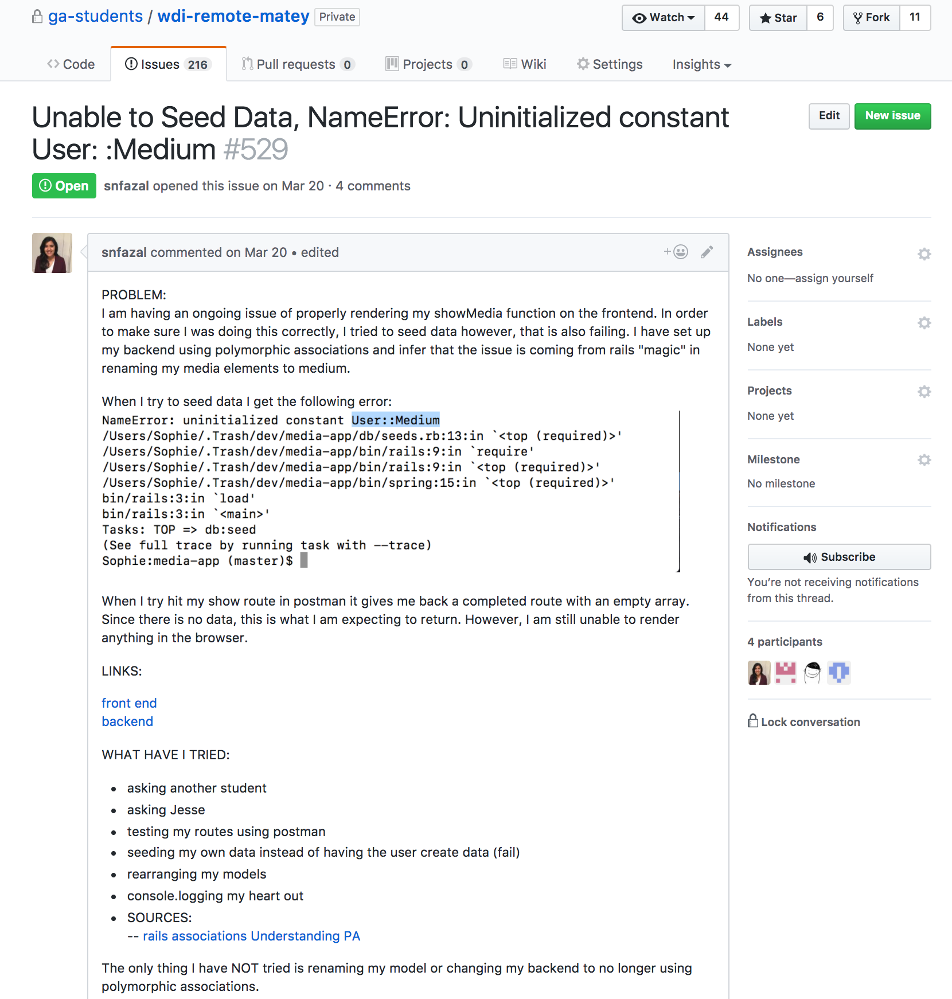
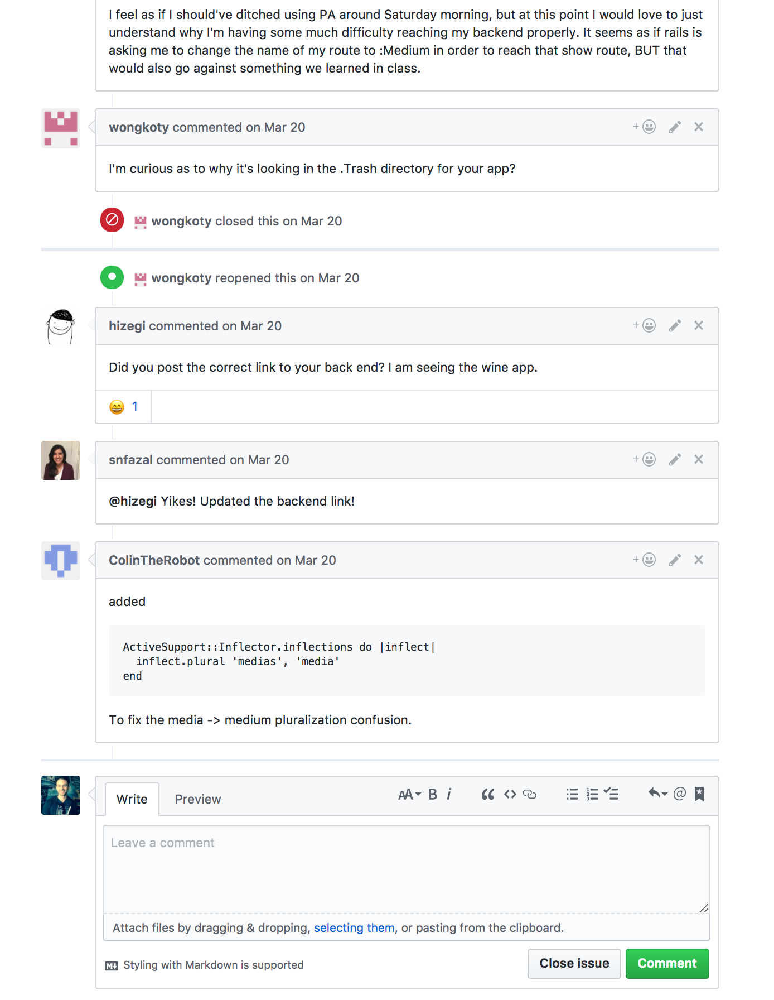

# Asking for Help

## Formatting your GitHub Issue to ask for help:

- PUSH OFTEN! Your code on GitHub should be up to date. Submitting an issue and linking us to old, out of date code is obviously going to hinder the process.

 

## CONTEXT

#### WHAT YOU ARE TRYING TO SOLVE:

- Write a detailed explanation of the feature or user story you're working on.

#### DETAILED DESCRIPTION OF THE BUG/ERROR:

- A detailed description of the problem, the bug, and the error.
- This means the full steps to reproduce, a link to the file on GitHub, and the line number of where the relevant code is.
- The error(s) returned, copy and pasted/typed out/screenshot, not paraphrased.
- If there is other code in a different file that is also essential to the functioning of the code that currently works, point us to that and explain the relationship.

### WHAT I'VE TRIED

- Who have you asked for help?
- List everything you've done to solve the bug on your own in detail. 
- List all resources you've looked up and tried to implement and provide links. 
- Providing code if you have it surrounded by the md syntax to display nicely is very helpful.

### QUESTION

- After going through all this what is your question specifically, more specifically than how can I make this work?

### Sample Issue

